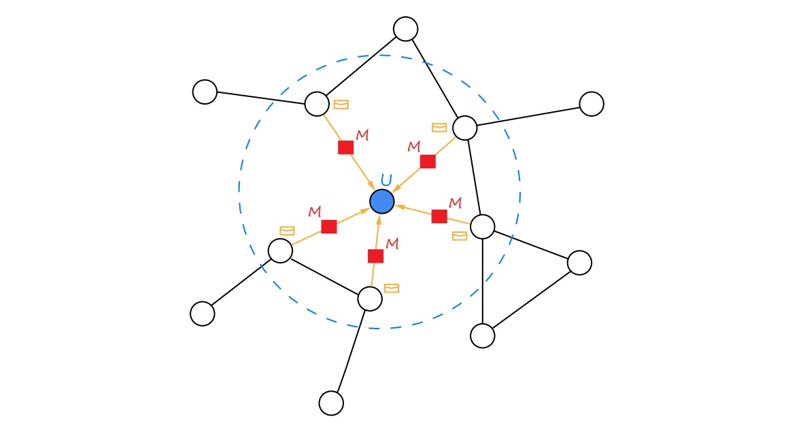

# Materials for  "Introduction to Graph Representation Learning"  mini-course.

### <a href="https://github.com/d-eremeev/">Dmitry Eremeev</a>

The mini-course covers the basics of **Graph Representation Learning** / **Graph Neural Networks**. 

The following topics are included:
- Motivation for graph representation learning. Several examples of benchmarks.
- Brief review of graph and matrix theory, notion of embeddings.
- Necessary **NLP** models reminder: from **word2vec** to **Transformers**. 
- **Random Walk** Graph Embeddings: **node2vec**, **struct2vec**.
- **Message Passing** Embeddings: **GraphSAGE**, **Graph Attention Network**.
- **Unsupervised** Graph Embeddings, notion of **Triplet Loss**.

Repository is organized as follows:
- **Graph_Slides.pdf**  - materials for the lectures
- **Seminars**:
    1. **PyTorch_Geometric_Dataset.ipynb** - introduces **CORA** dataset, covers the creation of **PyTorch Geometric Dataset** based on this graph. This dataset will be used in the following seminars for model training.
    2. **GraphModel_Supervised.ipynb** - acquaints with **NeighborSampler** and the concept of **mini-batch learning** on large graphs. Then the training process of supervised **Graph Attention Network** is covered.
    3. **GraphModel_Unsupervised.ipynb** - covers training of unsupervised **GraphSAGE** model. Visualization of resulting node embeddings using **UMAP** is included.
  

